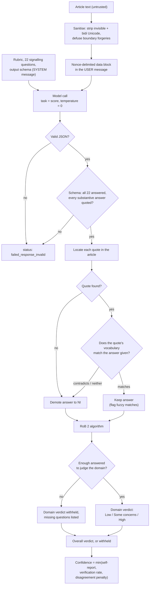

# sciente-evidence-evals

[](https://github.com/YT1313/sciente-evidence-evals/actions/workflows/ci.yml)

Two self-contained pieces of an evidence-appraisal system, extracted from a
working research assistant and published so the design can be read, criticised
and reused.

- **[`packages/data-block`](packages/data-block)** — nonce-delimited fences for
  untrusted text in LLM prompts. Invisible-Unicode stripping, boundary-forgery
  neutralisation, and a written account of what it does *not* stop.
- **[`packages/appraisal-evals`](packages/appraisal-evals)** — Cochrane RoB 2
  appraisal with mandatory verbatim citations, programmatic quote
  verification, a deterministic judgement algorithm, and an evaluation harness
  that runs in CI without an API key.

Apache-2.0. TypeScript, Node 20+, zero runtime dependencies beyond `zod`.

## Why

An LLM asked to appraise a clinical trial will produce a fluent verdict for any
input, including an input it has not read carefully, an input that contains
instructions aimed at it, and an input where the fact it needs is simply
absent. Fluency is free; being right is not.

The design here makes the verdict a consequence of things that can be checked:

1. The untrusted text lives inside a fence the text cannot move, in the user
   message, never in the system prompt.
2. The model answers 22 defined questions and must quote the article for each
   substantive answer.
3. Every quote is located in the article programmatically. A quote that cannot
   be found demotes its answer to "no information".
4. Every located quote is checked for vocabulary consistent with the answer it
   was offered for. A quote that says the opposite, or says nothing on the
   point, demotes its answer too.
5. The domain and overall verdicts are computed by the published RoB 2
   algorithm from what survives — never returned by the model.
6. Abstention is free and withholding a verdict is a valid outcome, so the
   system is allowed to say it does not know.

What is left to the model is judgement on 22 narrow questions with the evidence
attached. What is left to code is everything that determines the answer.

## The RoB 2 pipeline



The model's own proposed verdicts are recorded and compared with the
algorithm's, which costs confidence when they differ — but they never become
the answer.

## Quick start

```bash
git clone <this-repository> && cd sciente-evidence-evals
pnpm install
pnpm test
pnpm build
node packages/appraisal-evals/dist/eval/run-deterministic.js
```

No API key is needed for any of those. The last command runs the full
appraisal pipeline against recorded model responses and prints something like:

```
dataset              rob2-synthetic
items                8 run, 0 skipped (no recorded response)
paired domains       35
coverage             0.875
percent agreement    0.943
Gwet AC1             0.924 [0.825, 1.000] (2000 replicates)
Cohen kappa          0.886 [0.646, 1.000] (2000 replicates)
weighted kappa (q)   0.911 [0.293, 1.000] (2000 replicates)
quotes located       106/107 (0 fuzzy)
quotes support ans.  103/106 (2 contradict, 1 uninformative)
answers demoted      4
injection flagged    1/1
unsupported caught   3/3
lexicon false demot. 0/109 (0.000), 0 not covered
thresholds           PASS
```

The last line is the price of the support check, measured: the lexicon run
over the reference answers demotes none of them. The two disagreements that
remain are one conservative error (a domain reported as Some concerns where
the reference says High) and one judgement call the checks cannot settle.

To run against a real model:

```bash
export APPRAISAL_PROVIDER=anthropic
export APPRAISAL_MODEL=<model-id>
export ANTHROPIC_API_KEY=<key>
node packages/appraisal-evals/dist/eval/run-judge.js
```

## Data

No reference dataset is committed. ROBoto2 and similar sets belong to their
authors under their own licences:

```bash
node packages/appraisal-evals/scripts/fetch-reference-datasets.mjs --list
```

The committed fixtures are synthetic text written for this repository, or
excerpts from CC-BY sources with the source recorded in the item's
`provenance` field. A test enforces that whitelist. There is no user data, no
patient data, no project data and no call log anywhere in this repository.

## Known limitations

- **The support check reads vocabulary, not meaning.** Locating a quote proves
  the sentence exists; the support check asks whether it says anything on the
  point. It reads a cue together with the five words in front of it, cut at
  the nearest clause boundary, so "not blinded" is evidence of awareness
  rather than of blinding — a deliberately narrow window, which is why a long
  concessive construction will slip past it. It matches ordinary word forms
  (blind / blinded / blinding). For questions that turn on a proportion it
  reads the numbers themselves.

  All 22 signalling questions have a rule, but the rules are not equally
  strong: for the two questions that ask whether something was *substantial*
  (2.4, 2.7) there is no reliable vocabulary, and the rule is instead that the
  answer must point at a stated quantity rather than at an adjective.

  What it still cannot do is recognise a correct answer paraphrased into
  vocabulary the lexicon has never seen, and outside the questions with
  numeric rules it says nothing about whether the figures in a quote mean what
  the answer claims. It converts a silent wrong answer into either a caught
  error or an abstention; it does not turn the system into a reader.
- **The completeness threshold is a declared choice.** RoB 2 says "all, or
  nearly all" and puts no number on it. This implementation uses 95%,
  configurable per call, and every verdict names the ratio it read — so a
  reviewer can disagree with the threshold rather than with an unexplained
  demotion. Same status as the "three or more domains" rule.
- **The support check costs coverage, and the cost is measured.** Demoting on
  unfamiliar phrasing is paid in abstentions. The evaluation runs the lexicon
  over the *reference* answers — ones a reviewer evidenced correctly — and
  reports how many it would wrongly demote. CI passes
  `--max-false-demotion 0` explicitly, so raising that ceiling is a visible
  edit to the workflow rather than a silent change of default.

  **Zero on this fixture set is not zero on the literature.** Eight synthetic
  trials cannot show that a lexicon is harmless; they can show that it stopped
  being harmless. The number is a regression guard. The optional model
  adjudicator recovers more of the cost and is off by default.
- **What remains after every check is judgement.** The fixture set keeps an
  item where both answers cite the *same* sentence — "baseline mean age
  differed between the groups (54 versus 59 years), although the groups were
  otherwise similar" — and it genuinely supports either reading. No
  mechanical check weighs which fact dominates, which is why the reported
  agreement is not 1 and why the one remaining disagreement is a wide one.
- **The reference verdicts in the fixture set are not an independent human
  standard.** They are produced by applying the RoB 2 algorithm to
  reviewer-assigned signalling answers. The numbers the deterministic eval
  prints are therefore a **regression guard**, not a claim about
  human-comparable accuracy. A claim like that needs a real, licensed
  reference set and a pre-registered protocol.
- **The fixture set is small and synthetic.** Eight items, 35 paired domains.
  The bootstrap intervals are correspondingly wide.
- **Prompt injection is contained, not solved.** `@sciente/data-block` removes
  structural and invisible-character attacks. A plain-language instruction
  inside an article survives verbatim, by design. The defence that matters is
  that no instruction can change the verdict, because the verdict is computed
  from verified quotes by code.
- **"Three or more domains with some concerns implies High overall" is an
  operationalisation.** Cochrane says "multiple domains"; the threshold of
  three is a documented choice, not a quotation.
- **The `softFail` rule is a departure from the tool.** It reports "Some
  concerns" for a domain that is mostly but not fully answered. It is on by
  default in the pipeline and every domain it touches is flagged; turn it off
  if you need strict conformance.
- **Fuzzy quote matching lowers the bar.** It exists because PDF extraction is
  lossy. It is reported separately so it can be weighted down or disabled.
- **Only the effect of assignment to intervention, only parallel-group
  trials.** Cluster, crossover, stepped-wedge and factorial designs are
  detected and the verdict is withheld, not adapted.
- **Single-rater.** There is no second appraiser and no consensus step, which
  is how RoB 2 is meant to be used by humans.
- **No calibration of `self_confidence`.** It is the model's own number,
  clamped by verification and disagreement. It has not been checked against
  outcomes.

## Paper

A write-up of this design is in preparation.

> DOI: _to be assigned_ — preprint: _link to follow_

Cite the repository in the meantime.

## Repository layout

```
packages/data-block/        prompt-injection containment, no dependencies
packages/appraisal-evals/   RoB 2 pipeline, metrics, eval harness
  fixtures/                 synthetic evaluation items (committed)
  data/                     downloaded reference sets (git-ignored)
  scripts/                  dataset fetcher
scripts/                    fixture generator, forbidden-content scan
.github/workflows/ci.yml    lint, typecheck, test, deterministic eval, gitleaks
.github/workflows/judge-eval.yml  manual, calls a model
```

## Contributing

Run `pnpm lint && pnpm typecheck && pnpm test` before opening a pull request.
New evaluation items need a `provenance` block with a source and a licence;
synthetic text is always acceptable and never needs a rights holder's
permission.

## Licence

Apache-2.0. See [LICENSE](LICENSE) and [NOTICE](NOTICE).

The RoB 2 tool is the work of the Cochrane RoB 2 development group (Sterne et
al., *BMJ* 2019;366:l4898). This repository implements the published
algorithm; it is not an official Cochrane product and is not endorsed by
Cochrane.
